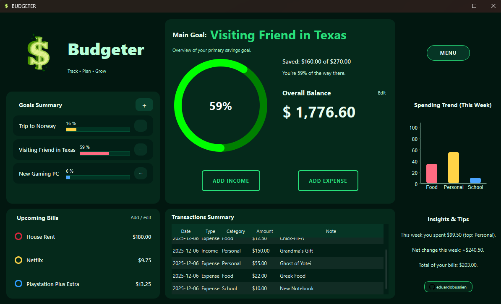
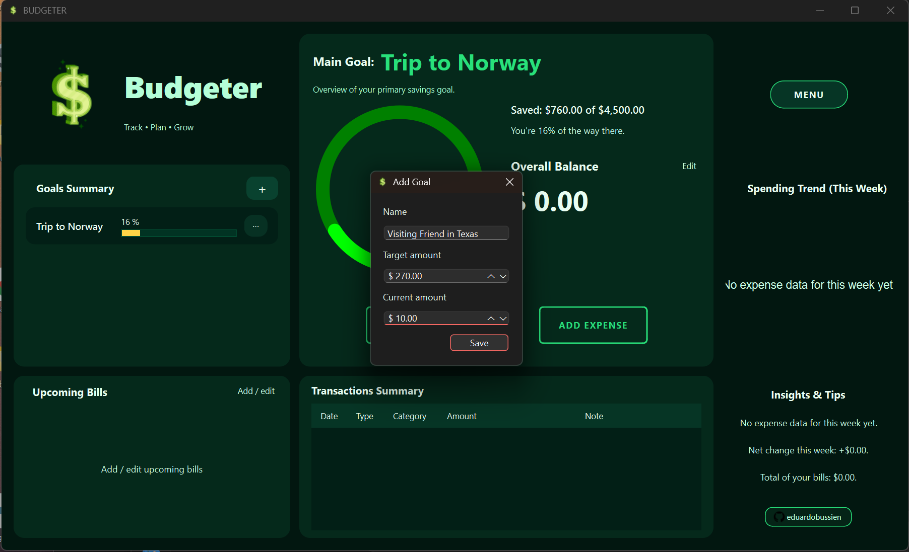
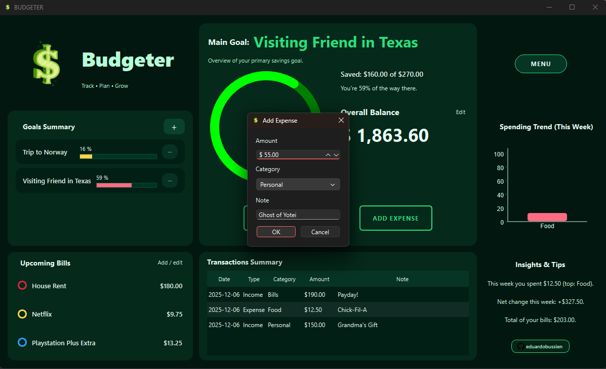

# Budgeter
A modern desktop budgeting app built with Python & PyQt6.

Budgeter is a desktop personal finance application designed to help users track goals, bills, expenses, income, and overall financial progress through a clean and intuitive interface. The project was developed as part of a Software Engineering course, with emphasis on modular design, project planning, documentation, and clean architecture.

## Features

### Dashboard
A responsive 3×3 grid layout inspired by modern budgeting tools:
- **Top-left:** App title + logo  
- **Top-right:** Menu (placeholders for future profile/settings)
- **Center:** Main Goal with circular progress bar
- **Bottom:** Goals Summary, Upcoming Bills, Transaction Summary, and Insights

### Goals Management
- Create, edit, or delete goals  
- Choose any goal as the **Main Goal**  
- Dynamic progress bars and percentage calculations  
- Goals are stored in JSON and restored on launch  

### Bills Tracking
- Add or edit upcoming bills  
- Colored visual category markers  
- Bills stored persistently in JSON  

### Balance & Transactions
- Edit overall balance directly  
- Add Income or Add Expense  
- Each transaction includes:  
  - Amount  
  - Category (Personal, Food, Bills, School, etc.)  
  - Optional note  
- Balance updates live  
- Transactions saved in JSON  
- Automatic pruning: entries older than 7 days are removed  
- Displayed in a scrollable **Transactions Summary** table  

---
## Screenshots
#### Dashboard Preview  

#### Goals Summary  

#### Transactions Table  

## Installation

1. Clone the repository:

git clone https://github.com/eduardobussien/BudgeterProject.git

2. Move into the folder:

cd BudgeterProject

3. Create a virtual environment:

python -m venv .venv

4. Activate the environment:

..venv\Scripts\activate # Windows
or:

source .venv/bin/activate # macOS/Linux

5. Install required dependencies:

pip install -r requirements.txt

---

## Running the Application

Once everything is installed, run:

python main.py

The program automatically creates JSON data files (`goals.json`, `bills.json`, `balance.json`, `transactions.json`).

---

## Running Tests

To run unit tests:

python -m unittest

OR:

pytest

---

## Technologies Used

- Python 3  
- PyQt6 (GUI framework)  
- JSON for persistent storage  
- unittest (testing)  
- Pathlib (filesystem paths)  

---

## Future Improvements Ideas

- Full Spending Trend graphs  
- Category-based visual reports  
- Export transactions to CSV  
- Multi-user profiles  
- Dark/Light themes  
- Full settings menu  

---

## Author

Eduardo Bussien  
https://github.com/eduardobussien
