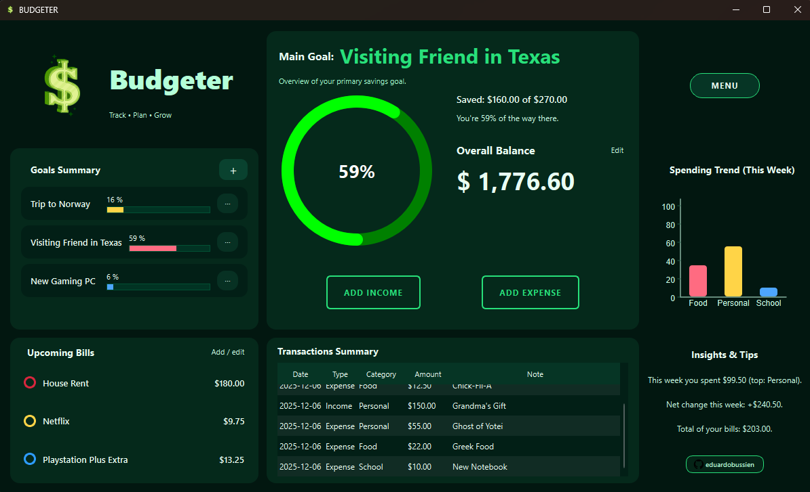
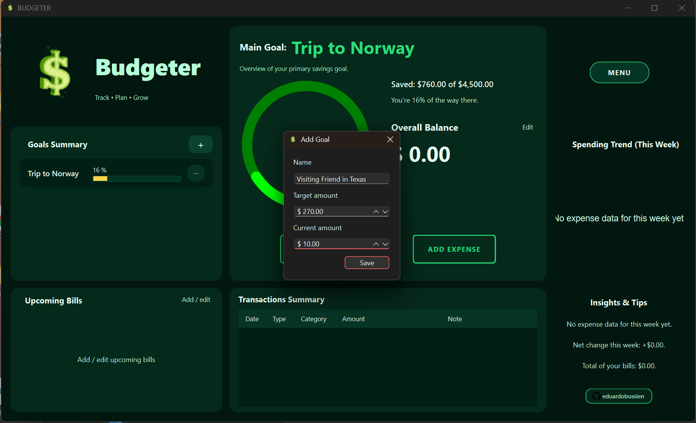
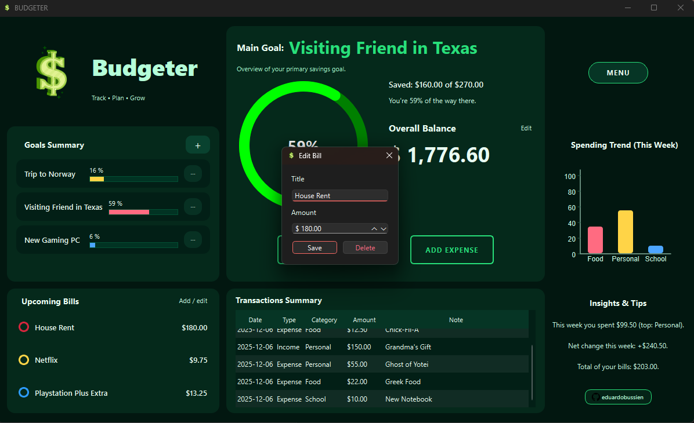
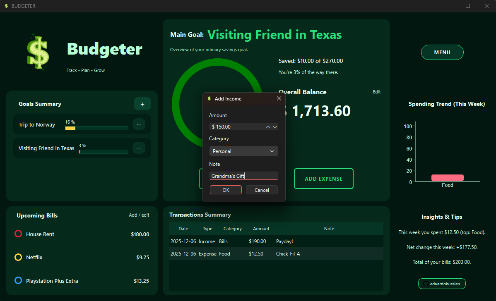
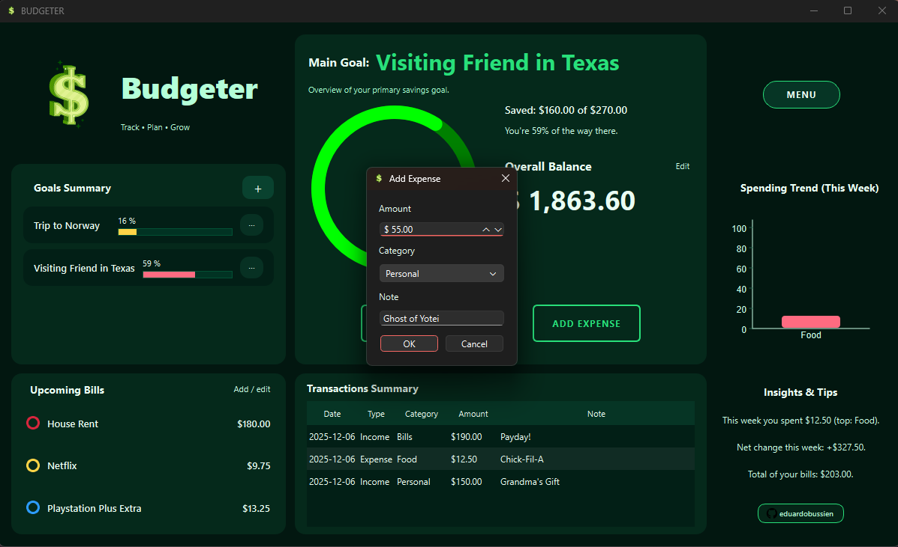
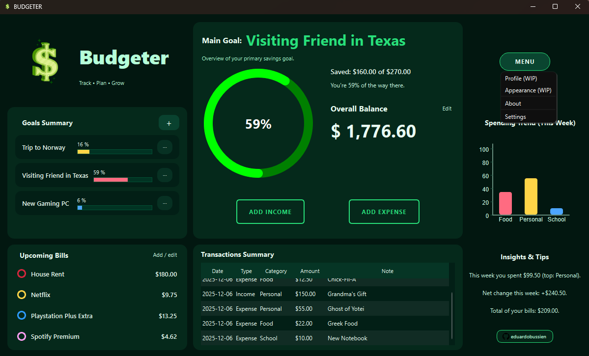
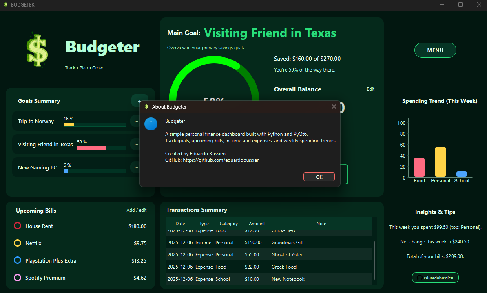

# Budgeter

[](https://github.com/eduardobussien/BudgeterProject/actions/workflows/ci.yml)
[](https://www.python.org/downloads/)
[](LICENSE)
[](https://github.com/astral-sh/ruff)
[](https://www.riverbankcomputing.com/software/pyqt/)

A modern desktop budgeting app built with Python & PyQt6.

Budgeter is a desktop personal finance application designed to help users track goals, bills, expenses, income, and overall financial progress through a clean and intuitive interface. The project was developed as part of a Software Engineering course, with emphasis on modular design, project planning, documentation, and clean architecture.

## Features

### Dashboard
A responsive 3×3 grid layout inspired by modern budgeting tools:
- **Top-left:** App title + logo
- **Top-right:** Menu (placeholders for future profile/settings)
- **Center:** Main Goal with circular progress bar
- **Bottom:** Goals Summary, Upcoming Bills, Transaction Summary, and Insights

### Goals Management
- Create, edit, or delete goals
- Choose any goal as the **Main Goal**
- Dynamic progress bars and percentage calculations
- Goals are stored in JSON and restored on launch

### Bills Tracking
- Add or edit upcoming bills
- Colored visual category markers
- Bills stored persistently in JSON

### Balance & Transactions
- Edit overall balance directly
- Add Income or Add Expense
- Each transaction includes:
  - Amount
  - Category (Personal, Food, Bills, School, etc.)
  - Optional note
- Balance updates live
- All data persisted in a single SQLite database
- Automatic pruning: entries older than 7 days are removed
- Displayed in a scrollable **Transactions Summary** table
- Export transactions to CSV from the menu

---

## Screenshots

#### Dashboard Preview


#### Goals Summary


#### Bills


#### Add Income / Add Expense



#### Menu & About



---

## Installation

1. Clone the repository:

   ```bash
   git clone https://github.com/eduardobussien/BudgeterProject.git
   ```

2. Move into the folder:

   ```bash
   cd BudgeterProject
   ```

3. Create a virtual environment:

   ```bash
   python -m venv .venv
   ```

4. Activate the environment:

   **Windows (PowerShell):**
   ```powershell
   .venv\Scripts\Activate.ps1
   ```

   **Windows (cmd):**
   ```cmd
   .venv\Scripts\activate.bat
   ```

   **macOS / Linux:**
   ```bash
   source .venv/bin/activate
   ```

5. Install required dependencies:

   ```bash
   pip install -r requirements.txt
   ```

---

## Running the Application

Once everything is installed, run:

```bash
python main.py
```

The program automatically creates a SQLite database (`budgeter.db`) in the `data/` folder (dev) or `%APPDATA%/BudgeterProject` (when packaged). If you're upgrading from an older JSON-based build, your existing `goals.json` / `bills.json` / `balance.json` / `transactions.json` are imported automatically on first launch.

---

## Running Tests

```bash
python -m unittest
```

or:

```bash
pytest
```

---

## Folder Organization

```
BudgeterProject/
├── data/
│   ├── img/
│   └── budgeter.db         (SQLite, generated at runtime, gitignored)
│
├── docs/
│   └── screenshots/
│
├── src/
│   ├── __init__.py
│   ├── budgeter_core.py     (data model: Transaction, Goal, Account)
│   ├── budgeter_gui.py      (compatibility shim — re-exports main / BudgeterWindow)
│   ├── main_window.py       (BudgeterWindow + app entry point)
│   ├── widgets.py           (CardWidget, CircularProgressBar, GoalRowWidget, etc.)
│   ├── dialogs.py           (Goal / Bill / Transaction edit dialogs)
│   ├── storage.py           (JSON load/save + path resolution)
│   └── theme.py             (color palette constants)
│
├── tests/
│   ├── __init__.py
│   └── test_budgeter_core.py
│
├── .gitignore
├── DESIGN.md
├── main.py
├── README.md
└── requirements.txt
```

---

## Technologies Used

- Python 3.11+
- PyQt6 (GUI framework)
- SQLite (persistent storage, via stdlib `sqlite3`)
- pytest / unittest (23 tests, including DB round-trips, prune logic, corrupt-file recovery, and JSON migration)
- ruff (lint + format)
- GitHub Actions (CI on Python 3.11 and 3.12)
- Pathlib (filesystem paths)

---

## Future Improvements Ideas

- Richer spending trend graphs (multi-week ranges, drill-down by category)
- Category-based visual reports
- Multi-user profiles (the SQLite schema makes this straightforward)
- Dark / Light themes
- Full settings menu
- Packaged `.exe` release on tag push via GitHub Actions

---

## License

Released under the [MIT License](LICENSE).

---

## Author

Eduardo Bussien
https://github.com/eduardobussien
